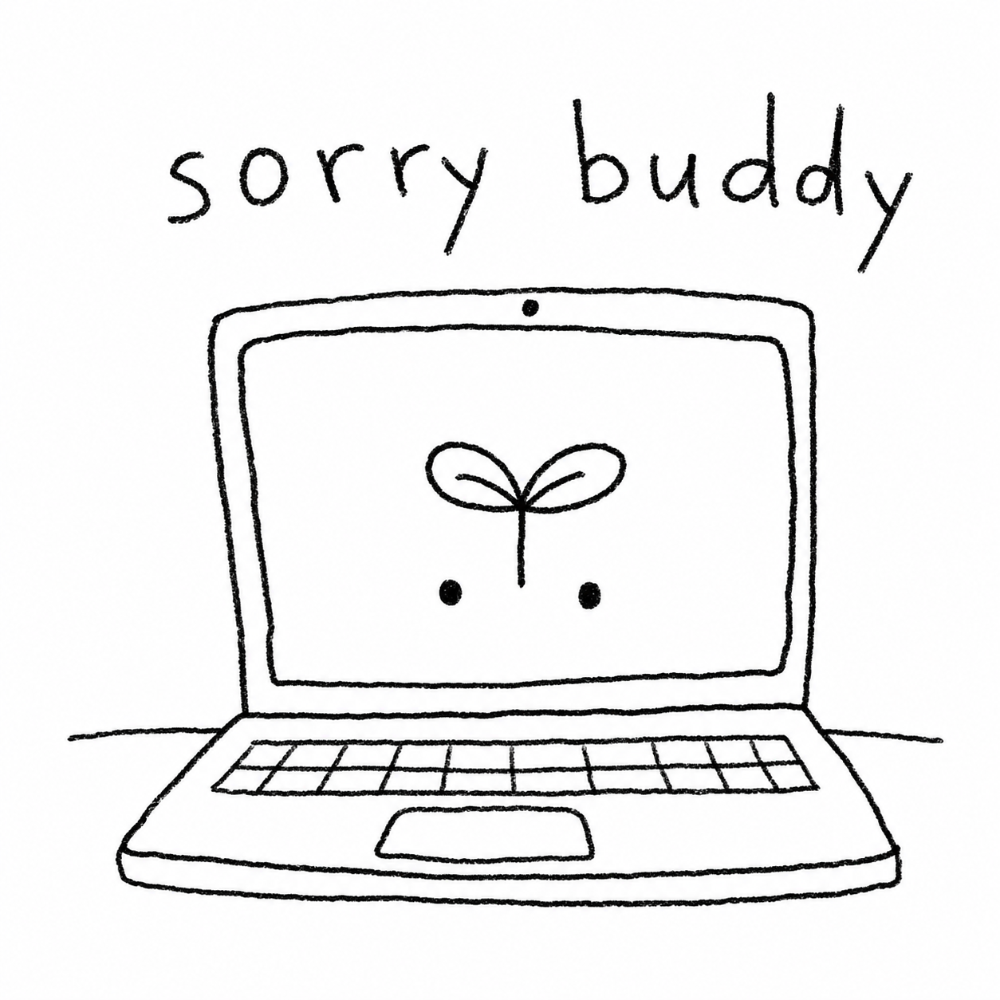

# SorryBuddy

**버전:** 0.1.7

[English README](README.md)

<p align="center">
  
</p>

SorryBuddy는 맥북 뚜껑을 닫아도 작업이 계속되도록 테스트하기 위한 작은 macOS 메뉴바 앱입니다. 닫힌 상태 작업 모드를 켜면 맥이 잠자기에 들어가지 않도록 설정하고, 뚜껑이 닫혔을 때 내장 디스플레이 밝기를 0으로 낮춘 뒤 뚜껑을 열거나 모드를 끄면 이전 밝기로 복구합니다.

이 앱은 개인 테스트용 실험 도구입니다. 반드시 통풍이 되는 책상 위에서만 사용하세요.

## 다운로드

최신 DMG 파일을 받으세요.

[SorryBuddy-0.1.7.dmg](https://github.com/hyun2xyz/sorrybuddy/releases/latest/download/SorryBuddy-0.1.7.dmg)

다운로드한 DMG를 열고 `SorryBuddy.app`을 `Applications`로 드래그하면 설치됩니다.

현재 빌드는 ad-hoc 서명만 되어 있고 Apple 공증은 되어 있지 않습니다. 처음 실행할 때 macOS가 막으면 시스템 설정의 개인정보 보호 및 보안에서 허용하거나, 앱을 우클릭한 뒤 `열기`로 실행하세요.

## 주요 기능

- 상단 메뉴바의 새싹 아이콘으로 제어.
- `pmset -a disablesleep` 기반의 닫힌 상태 잠자기 방지.
- 전원 설정 변경 전 관리자 승인 요청.
- 제어 창을 닫아도 앱은 메뉴바에 계속 유지.
- 뚜껑이 닫히면 내장 디스플레이 밝기를 0으로 변경.
- 뚜껑을 열거나 모드를 끄면 이전 밝기 복구.
- 60초마다 배터리 안전 상태 확인.
- 배터리 사용 중 10%에 도달하면 모드 자동 종료.
- GitHub Releases 기반의 수동 업데이트 확인.
- 문제가 생겼을 때 표준 `pmset` 명령으로 긴급 복구 가능.

## 디자인

README 상단에는 맥북 화면 안에 남아 웃고 있는 작은 친구 스케치를 넣었습니다. 앱 아이콘과 메뉴바 아이콘은 이 친구의 눈과 새싹 형태를 사용합니다.

## 요구 사항

- macOS 13 이상.
- 소스에서 빌드하려면 Apple Swift 6.1 이상.
- 닫힌 상태 작업 모드를 켜거나 끌 때 macOS 관리자 비밀번호 필요.

## 빌드

```bash
cd /Users/han/Documents/sorrybuddy
./scripts/package-app.sh
```

앱 번들은 아래 위치에 생성됩니다.

```text
/Users/han/Documents/sorrybuddy/.build/release/SorryBuddy.app
```

## 실행

```bash
open /Users/han/Documents/sorrybuddy/.build/release/SorryBuddy.app
```

## 사용법

1. `SorryBuddy.app`을 엽니다.
2. 제어 창의 스위치를 `켜짐`으로 전환합니다.
3. 안전 안내를 읽고 `켜기`를 선택합니다.
4. macOS 관리자 비밀번호를 입력합니다.
5. 맥북을 통풍되는 단단한 책상 위에 둡니다.
6. 뚜껑을 닫고 작업이 계속되는지 확인합니다.
7. 제어 창을 다시 열려면 메뉴바의 새싹 아이콘을 누르고 `제어 창 열기`를 선택합니다.
8. 모드를 끄려면 새싹 아이콘을 누르고 `닫힌 상태 작업 모드 끄기`를 선택합니다.
9. 앱을 완전히 종료하려면 새싹 아이콘을 누르고 `종료하기`를 선택합니다.

## 업데이트 확인

상단 메뉴바의 새싹 아이콘을 누르고 `업데이트 확인...`을 선택하세요. 새 버전이 있으면 GitHub Releases의 DMG 다운로드를 열 수 있습니다.

현재는 DMG 기반 수동 업데이트 방식입니다. Apple Developer ID 서명과 공증을 정리한 뒤에는 Sparkle 같은 macOS 표준 자동 업데이트 프레임워크로 확장할 수 있습니다.

## 메뉴바 아이콘이 안 보일 때

SorryBuddy는 Dock에 머무는 일반 앱이 아니라 메뉴바 에이전트 앱으로 실행됩니다.

메뉴는 열리는데 아이콘이 빈 공간처럼 보이거나, 상단 메뉴바에 새싹 아이콘이 보이지 않으면 Ice, Hidden Bar, Bartender 같은 메뉴바 정리 앱이 새 항목을 숨김 영역에 넣었을 가능성이 큽니다. 해당 앱을 열어서 `SorryBuddy`를 보이는 메뉴바 영역으로 옮겨주세요.

## 상태 확인

```bash
pmset -g | grep -E 'SleepDisabled|sleep'
```

켜져 있을 때 기대값:

```text
SleepDisabled        1
```

꺼져 있을 때 기대값:

```text
SleepDisabled        0
```

## 긴급 복구

앱이 종료되었거나 전원 설정이 이상해 보이면 아래 명령으로 잠자기 방지 설정을 끌 수 있습니다.

```bash
sudo pmset -a disablesleep 0
pmset -g | grep -E 'SleepDisabled|sleep'
```

그래도 전원 상태가 이상하면 맥을 재시동하세요.

## 안전 주의

아래 상황에서는 SorryBuddy를 사용하지 마세요.

- 가방, 파우치, 서랍, 케이스, 밀폐된 공간 안.
- 침대, 이불, 소파, 쿠션 같은 부드러운 표면 위.
- 직사광선, 더운 방, 자동차 안, 난방기 근처.
- 의심스러운 충전기, 허브, 독, 케이블 사용 중.
- 맥북이 이미 뜨겁거나, 팬 소음이 크거나, 손상/침수/배터리 팽창/불안정 증상이 있을 때.
- 밤새 방치하는 용도.

SorryBuddy는 사용자의 요청에 따라 macOS 전원 관리 설정을 변경합니다. 하드웨어 손상, 데이터 손실, 배터리 마모, 발열 피해, 작업 중단에 대한 책임은 사용자에게 있습니다.

## 배포 보안

암호화 DMG는 비밀번호를 모르면 마운트할 수 없게 만들 수 있습니다. 다만 사용자가 비밀번호로 DMG를 열고 앱을 실행한 뒤에는 앱 번들 내부를 볼 수 있으므로, "절대 뜯을 수 없는 앱"은 macOS 앱 구조상 만들 수 없습니다. 공개 배포에서 중요한 보안 기준은 Developer ID 서명, Apple 공증, stapling, 체크섬 검증입니다.

## 개발

테스트:

```bash
swift test
```

릴리즈 앱 빌드:

```bash
./scripts/package-app.sh
```

릴리즈 DMG 빌드:

```bash
./scripts/package-dmg.sh
```

암호화 DMG 빌드:

```bash
ENCRYPTED_DMG_PASSWORD_FILE="$HOME/Desktop/SorryBuddy.password.txt" ./scripts/package-encrypted-dmg.sh
```

배포 검증:

```bash
./scripts/verify-distribution.sh
```

보안 릴리즈 전체 빌드:

```bash
./scripts/secure-release.sh
```

릴리즈 PKG 빌드:

```bash
./scripts/package-pkg.sh
```

DMG와 PKG를 바탕화면에 함께 만들기:

```bash
./scripts/package-desktop.sh
```

코드는 아래처럼 나뉩니다.

- `Sources/SorryBuddy`: SwiftUI/AppKit 앱, 메뉴바 UI, 제어 창.
- `Sources/SorryBuddyCore`: 전원 상태 파싱, `pmset` 명령 래퍼, 배터리 정책, 뚜껑/밝기 조정.
- `Tests/SorryBuddyCoreTests`: 파서, 전원 정책, 밝기 조정 테스트.
